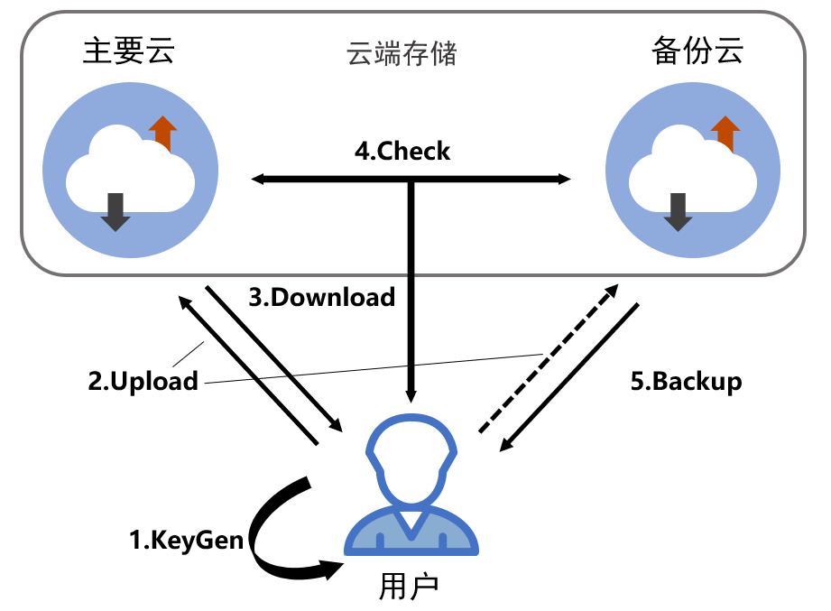

# DCSCA

This is a secure and controllable cloud photo album application under a dual-cloud architecture.

The project not only supports encrypted storage, encrypted sharing and browsing of cloud images, but also provides functions such as user clarification, cloud file integrity verification and data recovery. Currently, it uses Tencent Cloud + Alibaba Cloud's dual cloud object storage service, but it can be expanded to any object storage service. The project is developed in Java.

The following is a schematic diagram of the system framework of this project:



The project is developed using Java.

## Installation

1. Install requirements

   CloudSync installation requires [Java](https://www.java.com/en/download/) and [Android studio](https://developer.android.com/studio).

   Please install them before using this code.

2. Clone the code

   Use git to clone source code of this project to the local.

```
git clone https://github.com/szu-security-group/double-cloud-security-cloud-album.git
```

3. Install dependencies

   The Android studio configuration is as follows

  - java -- 18.0.1.1
  - Android Gradle Plugin Version -- 7.1.3
  - Gradle Version -- 7.2

## Usage

Open this project with **Android Studio**, click the `Sync Project Gradle Files` button to automatically download the dependent plugin.

Find the `Config.java` file under the `app/src/main/java/com/example/sca/Config.java` path, and modify the configuration parameters in it. For the specific application method of the parameters, see [Tencent Cloud Object Storage Preparations ](https://cloud.tencent.com/document/product/436/56390)，[Alibaba Cloud Object Storage (OSS) configuration access credentials](https://help.aliyun.com/zh/oss/developer-reference/oss-java-configure-access-credentials?spm=a2c4g.11186623.0.i6#ef3b9ec0ed3f0)

Run `MainActivity.java` to use this app

## Contributing

Please feel free to hack on DCSCA!


